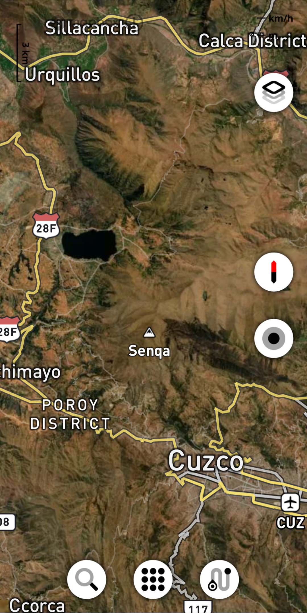

.. _index:

Pure Maps
=========

**Pure Maps** is an application for Linux to display vector and raster
maps, places, routes and provide navigation instructions with a
flexible selection of data and service providers. Its designed for mobile devices. 

   
.. image:: https://img.shields.io/github/v/release/rinigus/pure-maps
   :alt: Latest Release
   :target: https://github.com/rinigus/pure-maps/releases
   
.. image:: https://img.shields.io/badge/Ubuntu%20Touch-OpenStore-292929
   :alt: Ubuntu Touch
   :target: https://open-store.io/app/pure-maps.jonnius

.. image:: https://img.shields.io/badge/Flatpak-Flathub-4A86CF
   :alt: Flatpak
   :target: https://flathub.org/apps/details/io.github.rinigus.PureMaps

.. image:: https://img.shields.io/badge/O.B.S-Fedora-3C6EB4  
   :alt: Fedora
   :target: https://build.opensuse.org/package/show/home:rinigus:maps/pure-maps

.. image:: https://img.shields.io/badge/matrix.org-%23pure--maps-blue
   :alt: Matrix
   :target: https://matrix.to/#/#pure-maps:matrix.org

.. image:: https://img.shields.io/badge/forum-GitHub-FB9200
   :alt: Discussions
   :target: https://github.com/rinigus/pure-maps/discussions

.. Note::
   Add your content using ``reStructuredText`` syntax to ``docs-raw`` folder. See this `issue`_ and
   `reStructuredText <https://www.sphinx-doc.org/en/master/usage/restructuredtext/index.html>`_
   documentation for details.
   
.. _issue: https://github.com/rinigus/pure-maps/issues/400 
   

User feedback
--------------

Use `Github Issues`_ to address specific problems and development
requests.

General discussion is expected either through corresponding
topics in `Github Discussions`_,  `Github Issues`_ , `Matrix channel`_,
or `TMO`_ thread. 

.. _Github Issues: https://github.com/rinigus/pure-maps/issues

.. _Github Discussions: https://github.com/rinigus/pure-maps/discussions

.. _Matrix channel: https://matrix.to/#/#pure-maps:matrix.org

.. _TMO: https://talk.maemo.org/showthread.php?t=100442

.. toctree::
   :maxdepth: 2
   :caption: Content

   faq
   installation
   usage
   
