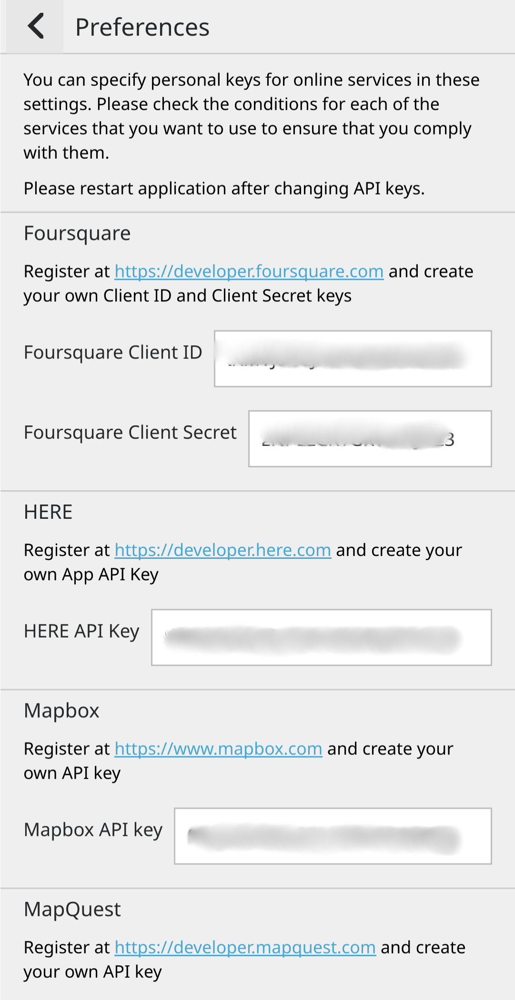

.. _installation:

Installation
==============

**Linux**

On most popular distributions Pure Maps can
simply be installed via package manager. 

.. image:: https://repology.org/badge/vertical-allrepos/pure-maps.svg
   :alt: Packaging status
   :target: https://repology.org/project/pure-maps/versions

For example on Alpine/postmarketOS:

.. code-block:: shell

 sudo apk add pure-maps osmscout-server
 

**Flatpak**
There is a Flatpak build on `flathub`_.

.. code-block:: shell

 sudo flatpak install flathub io.github.rinigus.PureMaps
 flatpak install flathub io.github.rinigus.OSMScoutServer
 
.. _flathub: https://flathub.org/apps/io.github.rinigus.PureMaps

**UBports**

Install via `open-store`_

.. _open-store: https://open-store.io/app/pure-maps.jonnius

**Sailfish**

Install via `chum`_

.. _chum: https://build.sailfishos.org/package/show/sailfishos:chum/pure-maps'

API Keys
---------
To get access to online  maps, its
recommended to go to ``Preferences > API keys``
and add API keys. You get them with
registering on each linked map provider.

