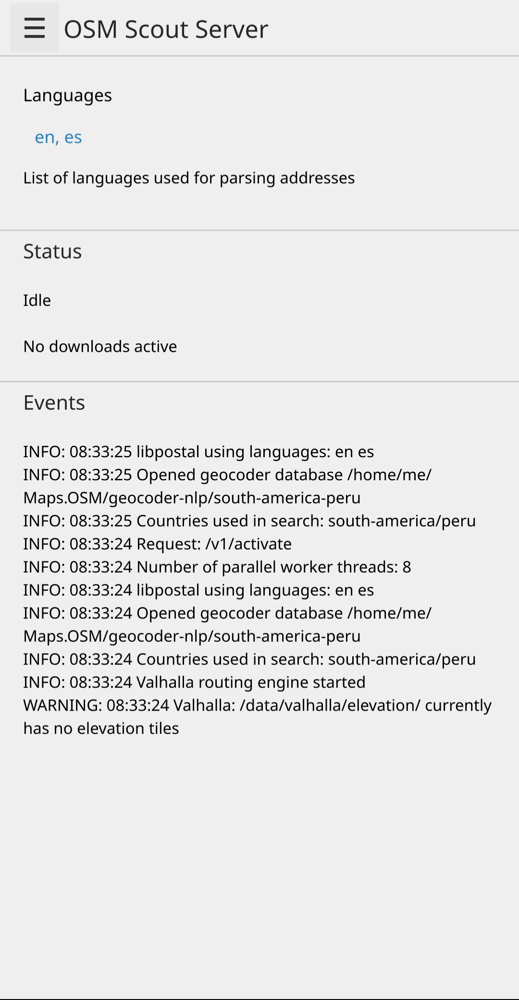
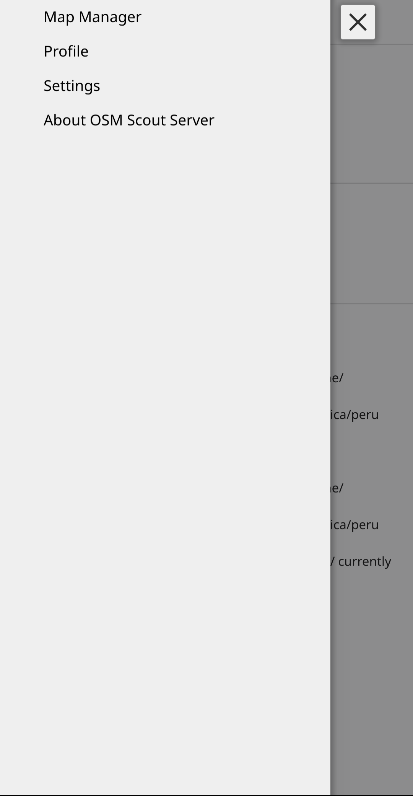

.. _osmscout-server:

Osmscout-server
===============

To use Pure Maps offline, run osmscout-server before opening Pure-Maps:

.. code-block::

   osmscout-server

Configure
---------
**Run:**

.. code-block::

   osmscout-server-gui

Then:

1. Define the prefered language 
2. Create default directory
3. Download world map
4. Subscribe to countries
5. Download offline maps
    (this might take a while due to limited capacity)

