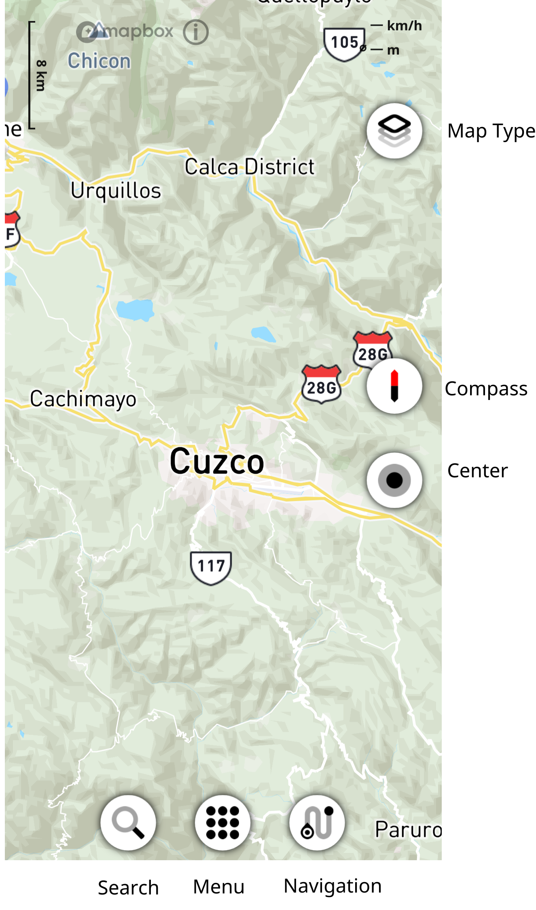
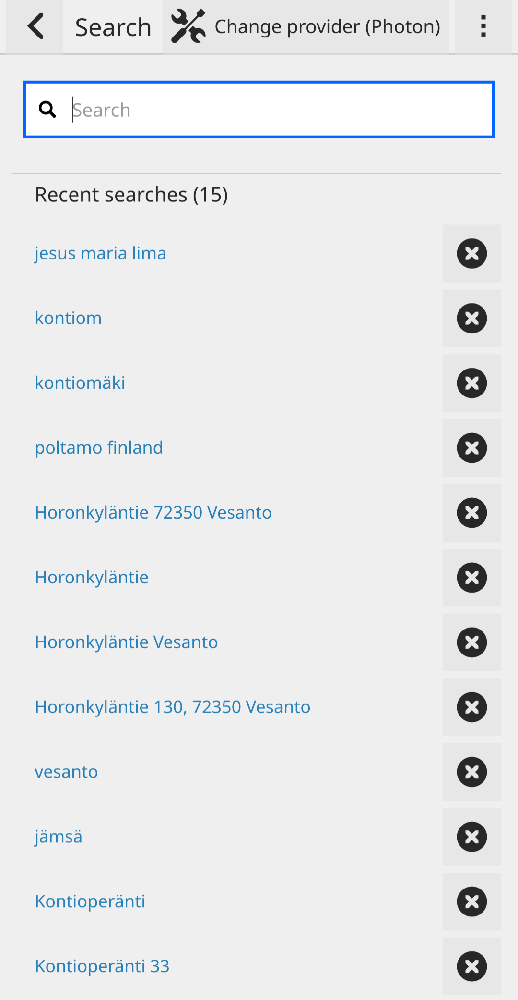
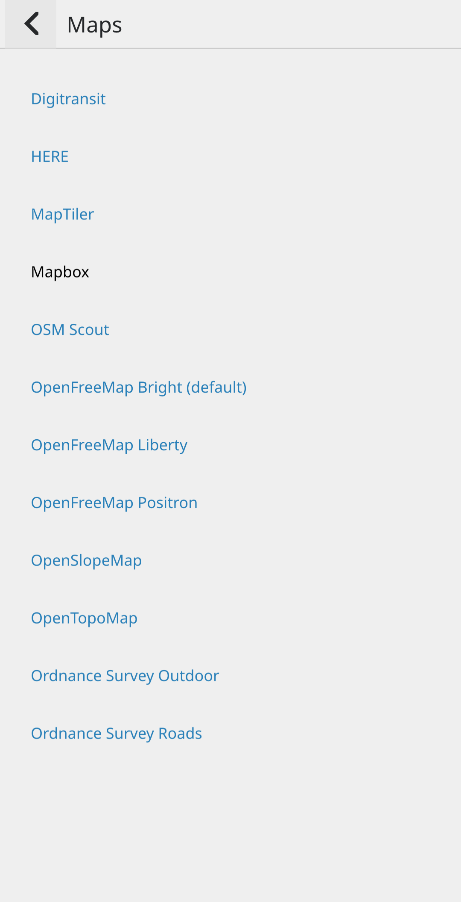
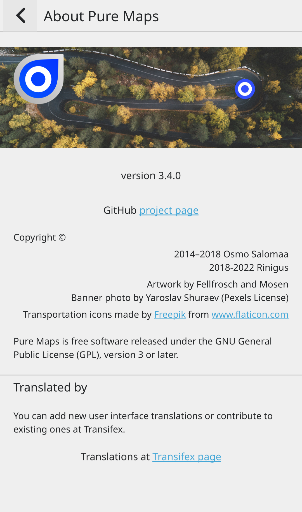
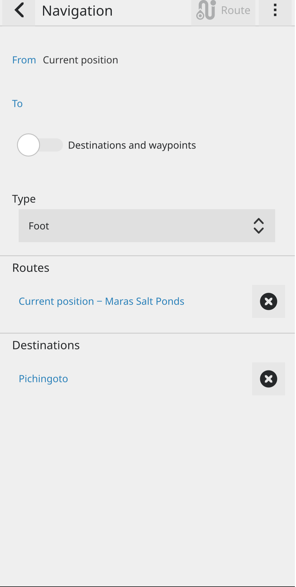
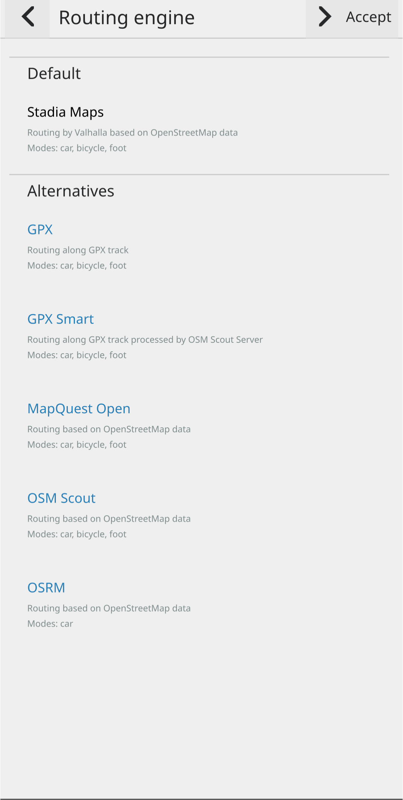

.. _Usage:

Usage
==============

Overview
---------

.. _Search:

Search
-------

Menu
-----
* Search
   See :ref:`Search` section.

* Navigation
   See :ref:`Navigation`.

* Nearby venues
* Bookmarks
* Share current position
* Maps
   Select online map provider.

* Preferences
* Profile
* About Pure Maps

.. _Navigation:

Navigation
-----------

.. _Offline-Navigation:

Offline-Navigation
-------------------

Make sure osmscout-server is installed, configured and running.

In ``Menu > Profile`` select ``Offline`` or ``Mixed``

See :ref:`osmscout-server`

.. _GPX-Import:

GPX-Import
-----------
``Menu > Navigation`` click the 3 dots and select
``Change provider`` select ``GPX`` and select your .gpx track under ``File``.

.. image:: _static/04_navigation_gpx_track.png
 :alt: navigation_gpx_track
 :width: 400

Map Type
--------

