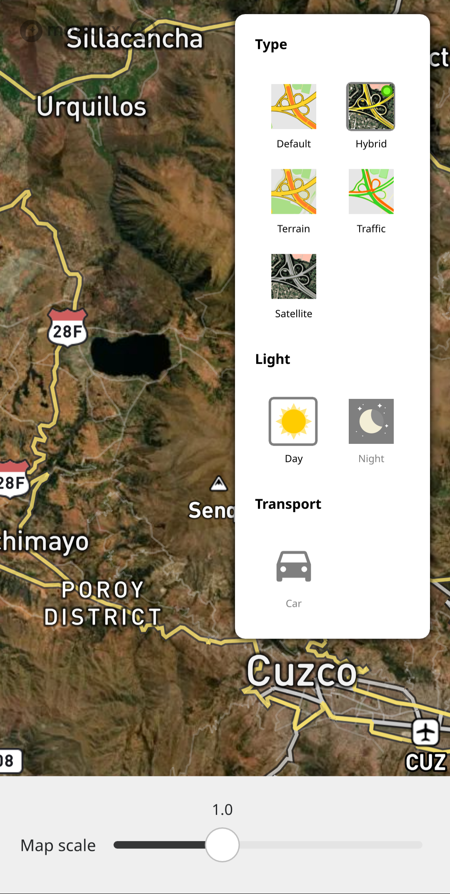

.. _Usage:

Usage
==============

Overview
---------

.. image:: _static/04_overview.png 
 :alt: overview
 :width: 400

.. _Search:

Search
-------

Menu
-----
* Search
   See :ref:`Search` section.

* Navigation
   See :ref:`Navigation`.

* Nearby venues
   Locate venues like ``Drinking Water``, ``Shelter``, ``ATM``, ``Petrol Station``.
   This only works with :ref:`osmscout-server` running and current map downloaded.

* Bookmarks
   Manage and store locations.
   

* Share current position

* Maps
   Select map provider. All except ``OSM Scout`` 
   are online providers which need :ref:`API_key`

.. image:: _static/04_maps_choice.png
 :alt: maps choice
 :width: 400

* Preferences

   
* Profile
   Choose to use online, offline or mixed profile.

* About Pure Maps

.. _Navigation:

Navigation
-----------

.. image:: _static/04_navigation.png 
 :alt: navigation
 :width: 400

The 3 dots menu:
   * Change provider
   	 ``OSM Scout``, ``GPX`` and ``GPX Smart`` work offline.
   	 The others only work when online.  
   * Follow me
   * Reverse route
   * Clear route

.. _Offline-Navigation:

Offline-Navigation
-------------------

Make sure :ref:`osmscout-server` is installed, configured and running.

In ``Menu > Profile`` select ``Offline`` or ``Mixed``

.. _GPX-Import:

GPX-Import
-----------
``Menu > Navigation`` click the 3 dots and select
``Change provider`` select ``GPX`` and select your .gpx track under ``File``.

.. image:: _static/04_navigation_gpx_track.png
 :alt: navigation_gpx_track
 :width: 400

Map Type
--------

