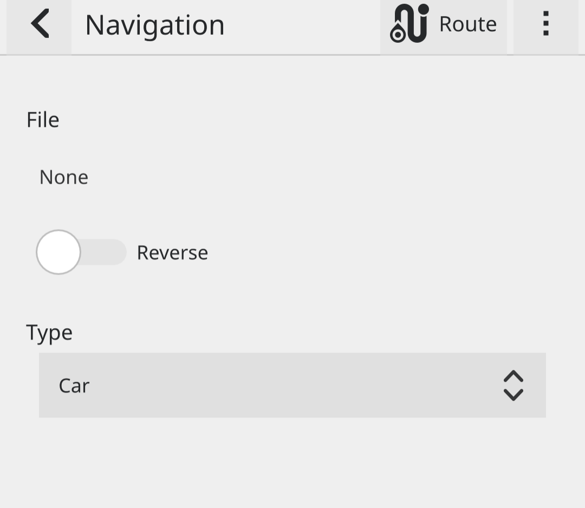

.. _Usage:

Usage
==============

Overview
---------

screenshot with menu, search, navigate, map type, compass and center

Navigation
-----------

.. _Offline-Navigation:

Offline-Navigation
-------------------

Make sure osmscout-server is installed, configured and running.

In ``Menu > Profile`` select ``Offline`` or ``Mixed``

See :ref:`osmscout-server`

.. _GPX-Import:

GPX-Import
-----------
``Menu > Navigation`` click the 3 dots and select
``Change provider`` select ``GPX`` and select your .gpx track.

.. image:: _static/04_navigation_routing_engine.png 
 :alt: navigation_routing_engine

